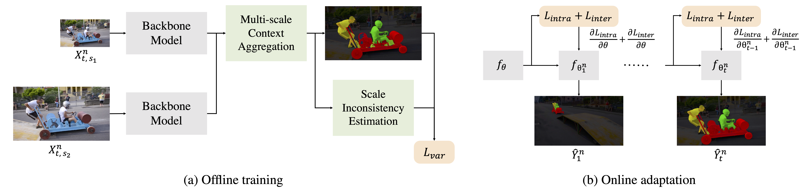

# SIRNet

This is the PyTorch implementation for "Boosting Video Object Segmentation based on Scale Inconsistency", ICME, 2022. We present a refinement framework to boost the performance of pre-trained semi-supervised video object segmentation models.




### Installation:

1. Download the DAVIS 16 and DAVIS 17 dataset
2. Edit the paths in mypath.py


### Offline training:

1. Training network on DAVIS 16 to get a good initialization

   ```
   python train_p.py
   ```

2. Edit the path in train_p_ms.py with the path to pretrained model and start offline training with our multi-scale context aggregation module with scale inconsistency-based variance regularization.

   ```
   python train_p_ms.py
   ```

   

### Online learning:

1. For online learning on DAVIS16 datasets, please edit the path in train_o_ms_so.py with the path to your offlined trained model and start online learning

   ```
   python train_o_ms_so.py
   ```

2. For online learning on DAVIS17 datasets, please edit the path in train_o_ms_mo.py with the path to your offlined trained model and start online learning

   ```
   python train_o_ms_mo.py
   ```

   

### Online Adaptation:

1. For online adaptation on DAVIS16 datasets, please edit the path in train_ada_so.py with the path to your online learned model and start online adaptation

   ```
   python train_ada_so.py
   ```

2. For online adaptation on DAVIS17 datasets, please edit the path in train_ada_mo.py with the path to your online learned model and start online adaptation

   ```
   python train_ada_so.py
   ```


### Visualization of Inter-frame adaptation loss

In ./Results, we put the visualization of our inter-frame adaptation loss. You can also generate this loss by running 

```
python inter_loss_visualization.py
```

